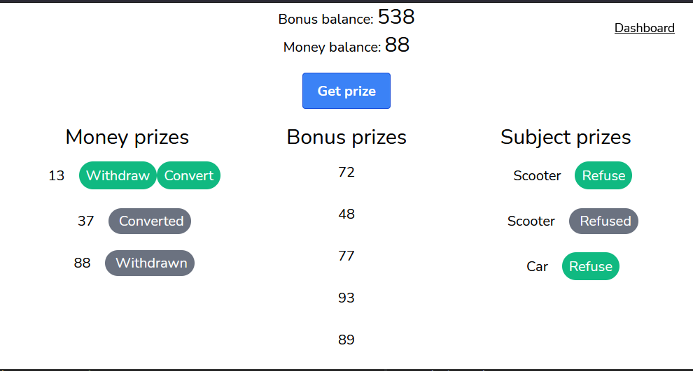

<p align="center"><a href="https://laravel.com" target="_blank"></a></p>

## Prize game



## Installation
- Download project from repository
```bash
git clone git@github.com:SergeyKoz/prize-game.git
```
- Run containers
```bash
docker-compose up
``` 

- Initialize app
```bash
docker exec -it --user www prize-game-app /bin/sh -lc "composer install && cp .env.example .env && php artisan key:generate && php artisan migrate"
``` 

- Commands
```bash
php artisan prize-game:send-money-to-bank --batch=10
php artisan prize-game:send-subject-to-email --subject=Plane --email=some@email.com
``` 


